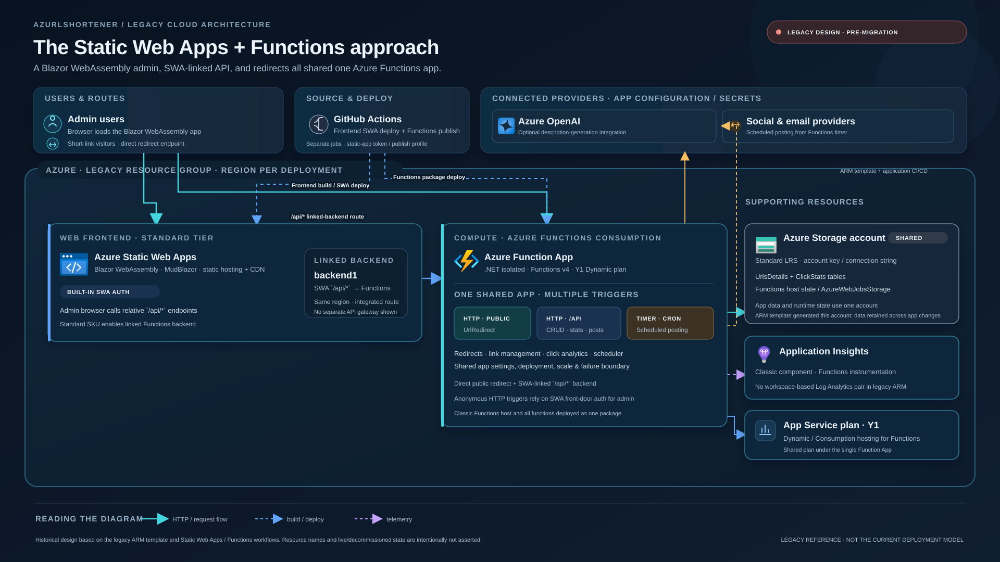
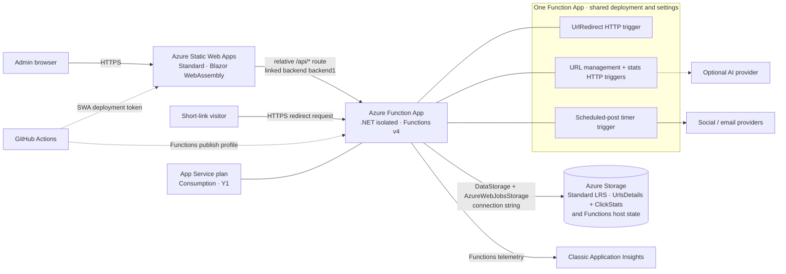

# AzUrlShortener legacy Azure architecture

This is the historical pre-migration design, reconstructed from the checked-in
legacy ARM template, Static Web Apps workflow, SWA CLI configuration, and
previous Functions code. It is a companion to the
[current production target architecture](azure-production-architecture.md),
not a claim about which legacy resources are currently running.

## Resource inventory

| Resource / component | Legacy role / configuration |
|---|---|
| Azure Static Web Apps | Standard tier; serves the Blazor WebAssembly / MudBlazor admin UI |
| Static Web Apps linked backend (`backend1`) | Links the SWA app to the Function App; browser requests at `/api/*` route to the backend |
| Azure Function App | One .NET isolated Functions v4 app; public redirect HTTP trigger, management/statistics API triggers, and the scheduled-post timer share a deployment, settings surface, and scale/failure boundary |
| Azure Functions App Service plan | Consumption / Dynamic `Y1` plan |
| Azure Storage account | Standard LRS; legacy ARM template uses the account for both `DataStorage` (URL/click tables) and `AzureWebJobsStorage` (Functions host state) |
| Application Insights | Classic `Microsoft.Insights/components` resource configured for Function App telemetry; not the current workspace-based Insights + Log Analytics arrangement |
| GitHub Actions | Separate build/deploy paths for Static Web Apps and the Azure Functions package; SWA token and Functions publish profile were deployment credentials |
| External social/email / AI providers | Configured integrations called by Functions; not provisioned by the legacy ARM template |

## Request and deployment flows

- Admin browsers download the Blazor WebAssembly app from Static Web Apps.
  Its app code calls relative `/api/*` routes; the Static Web Apps Standard
  linked-backend integration forwards those routes to the Function App.
- Short-link requests go directly to the public Function App's
  `UrlRedirect` HTTP trigger. The Function App also hosted admin APIs and the
  scheduled-post timer rather than isolating them into separate workloads.
- HTTP functions access URL and click tables via the configured storage
  connection. The same account also stores Functions host/runtime state.
- GitHub Actions built and deployed the SWA frontend and Functions package in
  separate jobs. The ARM deployment template also described the SWA,
  Function App, Y1 plan, storage, classic Application Insights, and linked
  backend. Deployment could optionally reference an existing SWA.
- Admin auth was the Static Web Apps Blazor authentication integration. It is
  not the server-side Microsoft Entra sign-in used by the newer admin app.

## Mermaid source

## Icon source

Official Microsoft Azure Architecture Icons are embedded unchanged in the
standalone SVG: Static Web Apps, Function Apps, Storage Accounts, Application
Insights, and Azure OpenAI. Microsoft permits the Azure icons in architecture
diagrams, training materials, and documentation under its
[icon usage terms](https://learn.microsoft.com/en-us/azure/architecture/icons/#icon-terms).
