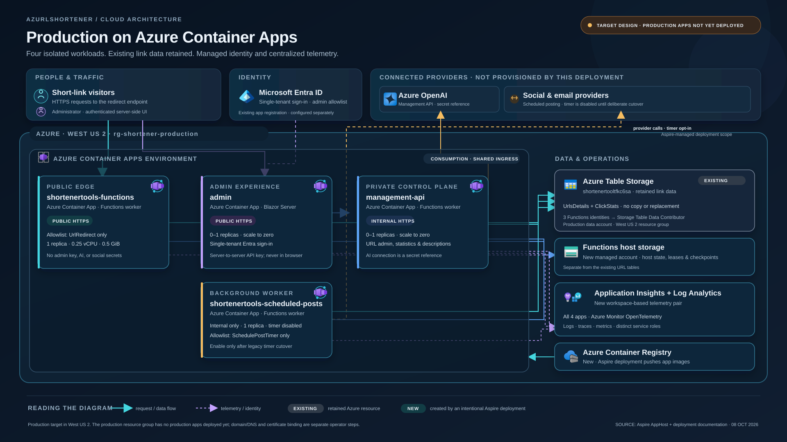
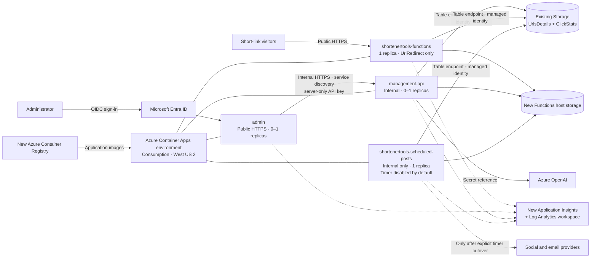

# AzUrlShortener production Azure architecture

This diagram describes the **intended production deployment**, not a claim that
the production application stack is live. As of October 8, 2026, the production
resource group `rg-shortener-production` is in West US 2 and has no production
apps deployed. Provisioning is an explicit Aspire deployment; the existing URL
data account is retained. Public DNS/custom-domain and certificate binding are
separate operator steps.

## Resource inventory

| Resource / component | Status | Architecture role |
|---|---|---|
| Azure Container Apps environment (Consumption) | New | Shared hosting and ingress boundary for the four application containers |
| `shortenertools-functions` Container App | New | Public HTTPS short-link redirects; exactly one replica, 0.25 vCPU / 0.5 GiB; only `UrlRedirect` enabled |
| `admin` Container App | New | Public HTTPS, server-interactive Blazor administration; zero-to-one replicas; single-tenant Entra authentication |
| `management-api` Container App | New | Internal HTTPS API for URL management, statistics, description generation, and manual posting; zero-to-one replicas |
| `shortenertools-scheduled-posts` Container App | New | Internal-only timer worker; one replica; only `SchedulePostTimer`; disabled by default until an intentional cutover |
| Azure Container Registry | New | Stores the built application images used by the Container Apps |
| Functions host storage account | New | Separate Azure Functions host state, leases, and checkpoints |
| Application Insights component | New | Workspace-based application telemetry for all four apps |
| Log Analytics workspace | New | Backing workspace for Application Insights |
| Per-app managed identities and storage role assignments | New | Functions apps use identity-based Table access; each receives Storage Table Data Contributor on the existing data account |
| `shortenertooltfkc6sa` Azure Storage account | Existing | Retains `UrlsDetails` and `ClickStats`; no table or record migration |
| Microsoft Entra app registration | Existing / configured separately | Single-tenant administrator sign-in; not provisioned by the Aspire deployment |
| Azure OpenAI and social/email providers | External dependencies | AI is called by the management API; scheduled integrations are used only after timer cutover |

Exact Azure-generated names for newly provisioned resources are deployment-derived;
the names above use the stable Aspire logical resource names where available.

## Request and data flows

- Visitors reach the public redirect Container App over HTTPS. It enables only
  `UrlRedirect` and does not receive the admin API key, AI connection, or social
  credentials.
- Administrators sign in to the public `admin` app through Microsoft Entra ID.
  The server-side app calls `management-api` over Aspire service discovery and
  internal HTTPS, using a server-only API key that is not sent to browser code.
- Redirect, management, and scheduler Functions use their managed identities
  for Table access to the existing account. The URL tables are neither copied
  nor replaced. These Functions apps also use the separate new host-storage
  account for Functions runtime state.
- The management API uses its Azure OpenAI connection as a secret reference.
  The redirect app receives no AI configuration. The scheduled-post worker
  reaches configured social/email providers only when intentionally enabled;
  the production timer defaults disabled.
- All four apps export logs, traces, and metrics to the new workspace-based
  Application Insights resource through Azure Monitor OpenTelemetry. The
  Functions apps have distinct host IDs and telemetry service names.
- Aspire provisions the Container Apps environment, registry, identities, host
  storage, and telemetry resources during explicit deployment. GitHub Actions
  deployment is manual and uses Azure OIDC; it does not alter DNS.

## Mermaid source

The SVG is sized at 1920 × 1080 and can be inserted into presentation software
as a vector graphic. The production target is not yet provisioned; do not use
the diagram as evidence that the production apps are live.

## Azure icon source

The Azure service marks in the SVG are embedded from Microsoft's official
[Azure Architecture Icons](https://learn.microsoft.com/en-us/azure/architecture/icons/)
set (downloaded October 8, 2026, V24): Container Apps Environment, Worker
Container App, Azure OpenAI, Table, Storage Accounts, Application Insights,
Log Analytics Workspaces, and Container Registries. Microsoft permits these
icons in architecture diagrams, training materials, and documentation subject
to its [icon terms](https://learn.microsoft.com/en-us/azure/architecture/icons/#icon-terms).
They are embedded unchanged; service names are shown alongside the marks.
The Microsoft Entra ID logo is embedded unchanged from the official
[Microsoft Entra architecture icon set](https://learn.microsoft.com/en-us/entra/architecture/architecture-icons)
(color icons, October 2023), under its [icon terms](https://learn.microsoft.com/en-us/entra/architecture/architecture-icons#icon-terms).
